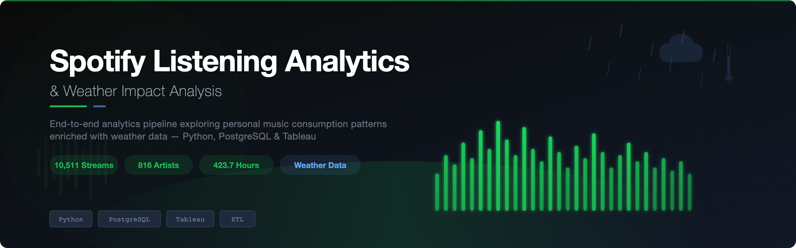
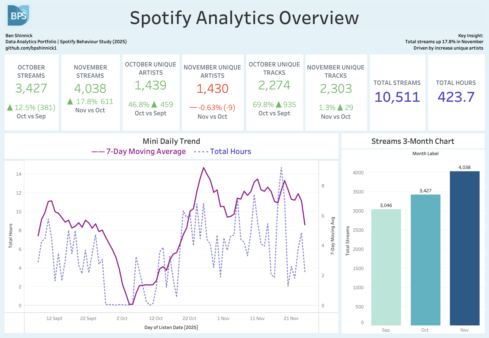
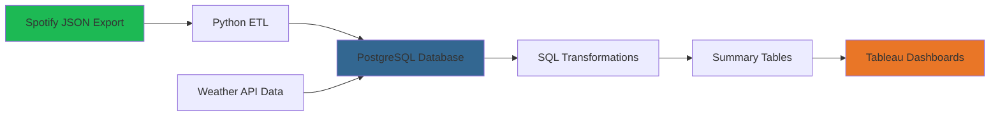

# 🎵 Spotify Listening Analytics & Weather Impact Analysis

<div align="center">




**End-to-end analytics pipeline analyzing personal Spotify listening behaviour enriched with weather data**

[View Live Dashboard](#dashboards) • [SQL Queries](sql/) • [Project Structure](#project-structure)

</div>

---

## 📋 Table of Contents

- [Project Overview](#-project-overview)
- [Key Features](#-key-features)
- [Tech Stack](#-tech-stack)
- [Dashboards](#-dashboards)
- [Key Insights](#-key-insights)
- [Data Pipeline](#-data-pipeline)
- [SQL Highlights](#-sql-highlights)
- [Project Structure](#-project-structure)
- [Setup & Usage](#-setup--usage)
- [Skills Demonstrated](#-skills-demonstrated)
- [Future Enhancements](#-future-enhancements)

---

## 🎯 Project Overview

This project demonstrates end-to-end data analytics capabilities by building a comprehensive listening behaviour analysis system. Using Spotify's Extended Streaming History data enriched with weather information, the project uncovers patterns in music consumption and explores how external factors like weather conditions influence listening habits.

### Project Scope

- **10,511** listening events analyzed
- **816** unique artists
- **2,046** unique tracks  
- **423.7** hours of listening time
- **Sep - Dec 2025** data period

### Business Questions Addressed

1. **When do I listen most?** Hour-by-hour and day-by-day pattern analysis
2. **What do I listen to?** Artist preferences, track diversity, and engagement metrics
3. **How does weather affect listening?** Correlation between weather conditions and music choices
4. **How engaged am I?** Skip rates, completion rates, and listening duration patterns

---

## ✨ Key Features

- **📊 Multi-dimensional Analysis**: Time-based, artist-based, and behavioural segmentation
- **☁️ Weather Integration**: Enrichment with precipitation and temperature data
- **🔄 Automated Pipeline**: Python → PostgreSQL → Tableau workflow
- **📈 Interactive Dashboards**: Three comprehensive Tableau dashboards with drill-down capability
- **🧹 Data Quality Focus**: Robust validation, null handling, and data profiling
- **⚡ Performance Optimized**: Indexed queries and aggregated summary tables

---

## 🛠️ Tech Stack

<table>
<tr>
<td align="center" width="33%">

**Data Processing**


- pandas for data transformation
- JSON parsing & enrichment
- Feature engineering

</td>
<td align="center" width="33%">

**Database & SQL**


- Database design & indexing
- Complex aggregations
- Window functions

</td>
<td align="center" width="33%">

**Visualization**


- Interactive dashboards
- Calculated fields
- Visual storytelling

</td>
</tr>
</table>

---

## 📊 Dashboards

### 1️⃣ Overview Dashboard



**Purpose:** Executive summary of listening behaviour and growth trends

**Key Metrics:**
- Monthly stream comparison (17.8% growth Oct→Nov)
- Unique artist/track diversity indicators  
- 7-day moving average for trend smoothing
- 3-month progression visualization

**Technical Highlights:**
- Calculated fields for month-over-month growth
- Dual-axis chart combining hours and streams
- Dynamic date filtering with parameter controls

---

### 2️⃣ Listening Patterns Dashboard


**Purpose:** Temporal analysis revealing *when* and *how* listening occurs

**Key Features:**
- **Hour × Day Heatmap**: Identifies peak listening windows (darker = more activity)
- **Session Length Distribution**: Categorizes listening sessions from quick plays to deep dives
- **Day of Week Trends**: Monday/Tuesday show highest engagement
- **Time of Day Breakdown**: Evening listening dominates at 25.5% of total activity

**Insights:**
- Consistent morning (6-12pm) and evening (6pm-12am) listening patterns
- Weekday listening is more routine-driven; weekends show varied behaviour
- Most sessions are quick listens (<15 min), suggesting mobile/on-the-go usage

---

### 3️⃣ Artists & Weather Impact Dashboard


**Purpose:** Content preference analysis and environmental influence on listening

**Key Findings:**
- **Rainy Day Lift**: +5.7% increase in listening during precipitation
- **Peak Engagement Temperature**: 10-13°C shows highest activity  
- **Weather-Dependent Artist**: Tranquillity shows 2.2x more plays on rainy days
- **Hans Zimmer Dominates**: Top artist with 1,052 plays

**Visual Components:**
- Scatter plot: Temperature vs. listening intensity
- Dual-location weather heatmaps (Melbourne & London)
- Comparative bar chart: Artist preferences by weather condition
- Weather-driven listening patterns overlay

---

## 💡 Key Insights

### 🕒 Temporal Patterns
- **Peak Hours**: 10-11am and 8-9pm show highest activity
- **Weekday Dominance**: Monday/Tuesday avg. 2,000+ streams each
- **Consistency**: 33.67% of listening occurs in the morning (6am-12pm)

### 🎵 Content Preferences  
- **Top Artist**: Hans Zimmer (1,052 plays) - soundtrack/cinematic preference
- **Diversity Score**: 816 unique artists across 10,511 streams = high exploration rate
- **Artist Loyalty**: Top artist represents ~10% of total streams (balanced but not obsessive)

### ☁️ Weather Impact
- **Rainy Days**: Average 5.6 hours listening vs. 5.3 hours on dry days
- **Temperature Sweet Spot**: 10-13°C range shows peak engagement
- **Genre Shift**: Ambient/instrumental artists (Tranquillity, Tioux) gain share during rain

### 📈 Growth Trends
- **Month-over-Month**: 17.8% increase Oct→Nov, driven by unique artist discovery
- **November Peak**: 4,038 streams (highest of period)
- **Session Types**: Majority are quick listens; "Deep Dive" (2hr+) sessions are rare

---

## 🔄 Data Pipeline



### Pipeline Stages

1. **Data Extraction**: Spotify Extended Streaming History (JSON format)
2. **Transformation**: Python script converts JSON → CSV with feature engineering
3. **Loading**: PostgreSQL database import with schema validation
4. **Enrichment**: Weather data joined at daily granularity  
5. **Aggregation**: SQL creates summary tables (artist, daily, hourly, monthly)
6. **Visualization**: Tableau connects directly to PostgreSQL

---

## 💻 SQL Highlights

### Artist Summary Table
```sql
CREATE TABLE artist_summary AS
SELECT 
    artist_name,
    COUNT(*) as total_plays,
    SUM(minutes_played) as total_minutes,
    ROUND(AVG(minutes_played), 2) as avg_song_duration,
    COUNT(DISTINCT track_name) as unique_tracks,
    COUNT(DISTINCT album_name) as unique_albums,
    SUM(CASE WHEN completed_listen THEN 1 ELSE 0 END) as completed_plays,
    SUM(CASE WHEN skipped THEN 1 ELSE 0 END) as skipped_plays,
    ROUND(SUM(CASE WHEN skipped THEN 1 ELSE 0 END) * 100.0 / COUNT(*), 2) as skip_rate,
    MIN(play_date) as first_played,
    MAX(play_date) as last_played
FROM spotify_streams
WHERE artist_name IS NOT NULL AND artist_name != 'Unknown Artist'
GROUP BY artist_name
ORDER BY total_plays DESC;
```

### Month-over-Month Growth Analysis
```sql
SELECT 
    month_name,
    year,
    total_plays,
    total_hours,
    LAG(total_plays) OVER (ORDER BY year, month) as previous_month_plays,
    total_plays - LAG(total_plays) OVER (ORDER BY year, month) as play_change,
    ROUND(
        (total_plays - LAG(total_plays) OVER (ORDER BY year, month)) * 100.0 / 
        NULLIF(LAG(total_plays) OVER (ORDER BY year, month), 0), 
        2
    ) as growth_percentage
FROM monthly_trends
ORDER BY year, month;
```

### Hourly Listening Patterns
```sql
CREATE TABLE hourly_patterns AS
SELECT 
    hour_of_day,
    time_of_day,
    COUNT(*) as plays,
    ROUND(AVG(minutes_played), 2) as avg_duration,
    COUNT(DISTINCT artist_name) as unique_artists,
    ROUND(COUNT(*) * 100.0 / SUM(COUNT(*)) OVER (), 2) as percentage_of_total
FROM spotify_streams
GROUP BY hour_of_day, time_of_day
ORDER BY hour_of_day;
```

[→ View all SQL transformations](sql/spotify_database_setup.sql)

---

## 📁 Project Structure

```
spotify-analytics/
│
├── data/
│   ├── raw/
│   │   └── Streaming_History_Audio_2025_12.json    # Original Spotify export
│   └── processed/
│       └── spotify_streaming_data_clean.csv         # Cleaned dataset
│
├── sql/
│   ├── spotify_database_setup.sql                   # Complete schema & transformations
│   └── validation_queries.sql                       # Data quality checks
│
├── python/
│   ├── convert_spotify_json.py                      # JSON → CSV converter
│   └── requirements.txt                             # Python dependencies
│
├── tableau/
│   ├── spotify_analytics.twbx                       # Packaged Tableau workbook
│   └── calculated_fields.md                         # Documentation of calcs
│
├── screenshots/
│   ├── dashboard_overview_1_.png
│   ├── dashboard_listening_patterns.png
│   └── dashboard_artists_weather.png
│
├── docs/
│   ├── PROJECT_SUMMARY.md
│   ├── Spotify_Analytics_Project_Guide.md
│   └── data_dictionary.md
│
└── README.md
```

---

## 🚀 Setup & Usage

### Prerequisites

- Python 3.8+
- PostgreSQL 12+ (or SQLite as alternative)
- Tableau Desktop or Tableau Public

### Installation Steps

1. **Clone the repository**
```bash
git clone https://github.com/yourusername/spotify-analytics.git
cd spotify-analytics
```

2. **Set up Python environment**
```bash
pip install -r python/requirements.txt
```

3. **Convert Spotify JSON to CSV**
```bash
python python/convert_spotify_json.py
```

4. **Create PostgreSQL database**
```bash
createdb spotify_analytics
psql spotify_analytics < sql/spotify_database_setup.sql
```

5. **Import data**
```bash
psql spotify_analytics -c "\COPY spotify_streams FROM 'data/processed/spotify_streaming_data_clean.csv' CSV HEADER"
```

6. **Open Tableau workbook**
- Open `tableau/spotify_analytics.twbx`
- Update data connection to point to your PostgreSQL database
- Refresh extracts

### Getting Your Spotify Data

1. Visit [Spotify Privacy Settings](https://www.spotify.com/account/privacy/)
2. Request "Extended Streaming History" (takes 1-30 days)
3. Download JSON files when ready
4. Place in `data/raw/` directory

---

## 🎓 Skills Demonstrated

### Data Engineering
- ✅ ETL pipeline design and implementation
- ✅ Data quality validation and profiling
- ✅ Feature engineering (time-based, categorical)
- ✅ Data normalization and denormalization strategies

### SQL & Database
- ✅ Schema design with appropriate data types
- ✅ Performance optimization (indexing, query tuning)
- ✅ Window functions (LAG, ROW_NUMBER, OVER)
- ✅ Complex aggregations and JOINs
- ✅ Summary table creation for analytics

### Data Visualization
- ✅ Dashboard storytelling and layout design
- ✅ Calculated fields and table calculations
- ✅ Interactive filtering and drill-down
- ✅ Color theory and visual hierarchy
- ✅ Heatmaps and advanced chart types

### Data Analysis
- ✅ Exploratory data analysis (EDA)
- ✅ Pattern recognition and trend identification
- ✅ Correlation analysis (weather vs. behaviour)
- ✅ Segmentation and cohort analysis
- ✅ Insight generation and communication

---

## 🔮 Future Enhancements

- [ ] **Machine Learning**: Predict future listening patterns using time series forecasting
- [ ] **Recommendation Engine**: Build collaborative filtering system based on listening history
- [ ] **Mood Analysis**: Integrate Spotify Audio Features API for energy/valence analysis
- [ ] **Real-time Dashboard**: Automate daily data refresh with Tableau Server/Cloud
- [ ] **Expanded Weather Data**: Add humidity, air pressure, seasonal indicators
- [ ] **Mobile App**: Create lightweight mobile dashboard using Tableau Mobile
- [ ] **Comparative Analysis**: Benchmark against global Spotify listening trends

---

## 📝 License

This project is licensed under the MIT License - see the [LICENSE](LICENSE) file for details.

---

## 👤 Author

**Ben Shinnick**

- GitHub: [@bpshinnick](https://github.com/bpshinnick)
- LinkedIn: [linkedin.com/in/benshinnick](https://linkedin.com/in/benshinnick)
- Portfolio: [Your Portfolio URL]

---

## 🙏 Acknowledgments

- Spotify for providing Extended Streaming History data access
- Weather data sourced from [Weather API Provider]
- Inspiration from music analytics community

---

<div align="center">

**If you found this project helpful, please consider giving it a ⭐️**

</div>
